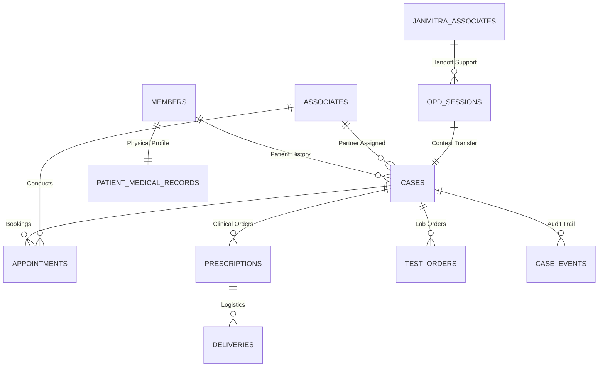

# Janmitra API: Ultimate System Walkthrough & Documentation

This document provides an exhaustive, field-level breakdown of **every database table** and **every API endpoint** within the Janmitra API ecosystem.

---

## 1. Exhaustive Database Schema Reference

The system utilizes 26 interconnected tables in PostgreSQL. Below is the purpose and linkage for each.

### 🏥 Core Patient & Clinical Data
1. **`members`**: Central patient directory.
   - *Fields*: `member_id`, `full_name`, `email`, `phone`, `address`, `medical_record_id`.
   - *Linkage*: Owner of `cases` and `patient_medical_records`.
2. **`patient_medical_records`**: Detailed health profile.
   - *Fields*: `age`, `height`, `weight`, `blood_group`, `allergies`.
   - *Linkage*: 1:1 with `members`.
3. **`cases`**: The master record for a clinical visit.
   - *Fields*: `status`, `description`, `emergency_flag`, `opd_state`, `triage_data`.
   - *Linkage*: Links `members` to `associates`, `services`, and all clinical outcomes.
4. **`opd_sessions`**: Real-time state of the AI chat flow.
   - *Fields*: `opd_state`, `collected_inputs`, `controlled_by` (AI/HUMAN), `language_preference`.
   - *Linkage*: Bridges the gap between a chat user and a formal `case`.

### 👨‍⚕️ Workforce (Partners & Associates)
5. **`associates` (Partners)**: Clinical professionals (Doctors).
   - *Fields*: `full_name`, `role`, `specialty`, `is_available`.
   - *Linkage*: Assigned to `cases` and `appointments`.
6. **`janmitra_associates` (Associates)**: Support and handoff staff.
   - *Fields*: `role`, `is_available`, `phone`.
   - *Linkage*: Referenced in `opd_sessions` for human handoffs.
7. **`doctor_availability`**: Booking slots for Partners.
   - *Fields*: `date`, `start_time`, `end_time`, `is_booked`.
   - *Linkage*: Linked to `associates`.

### 📋 Clinical Orchestration
8. **`services`**: Registry of available medical services.
   - *Fields*: `service_name`, `description`.
9. **`service_steps`**: Workflow definitions for services.
   - *Fields*: `step_name`, `step_order`.
10. **`case_services`**: Specific services linked to a case.
    - *Fields*: `status`, `scheduled_at`, `outcome`.
11. **`episodes`**: Groupings of related clinical steps within a case.
    - *Fields*: `episode_type`, `status`, `started_at`.
12. **`episode_steps`**: Execution status of individual steps in an episode.
13. **`opd_visits`**: Tracking of physical or virtual visits per case.
    - *Fields*: `visit_type`, `status`, `scheduled_at`.

### 💊 Outcomes & Orders
14. **`prescriptions`**: Master medication record.
    - *Fields*: `diagnosis`, `advice`, `status` (ACTIVE/DISPATCHED).
15. **`prescription_items`**: Individual medications.
    - *Fields*: `medicine_name`, `dosage`, `frequency`, `duration`.
16. **`test_orders`**: Diagnostic test requests.
    - *Fields*: `test_name`, `status` (ORDERED/COMPLETED), `result` (JSON).
17. **`referrals`**: Specialist referral records.
    - *Fields*: `specialty`, `reason`, `referred_to`.
18. **`appointments`**: Consultation bookings.
    - *Fields*: `appointment_type`, `scheduled_at`, `status`.
19. **`deliveries`**: Logistics tracking for prescriptions.
    - *Fields*: `address`, `status`, `eta`, `delivered_at`.

### 🛡️ Audit, Media & Notifications
20. **`case_events`**: Immutable timeline of every lifecycle event.
    - *Fields*: `event_type`, `actor_type`, `payload`.
21. **`case_status_history`**: Simple log of status transitions.
22. **`case_documents`**: File storage metadata.
    - *Fields*: `file_url`, `document_type` (IMAGE/PDF).
23. **`ai_interactions`**: NLP logs for AI training/debugging.
24. **`notifications`**: User-facing alerts.
    - *Fields*: `type`, `title`, `message`, `status`.
25. **`audit_logs`**: System-level security/action logs.
26. **`users`**: Backend credentials for admin access.

---

## 2. API Endpoint Directory (Every Controller)

### 🤖 Jana AI (`jana.controller.ts`)
- `POST /jana/message`: Main AI engine. Handles NLP, context building, and state transitions.
- `GET /jana/session`: State recovery for the frontend.

### 🏥 OPD Operations (`opd.controller.ts`)
- `POST /opd/verify-member`: Checks member existence.
- `POST /opd/create-case`: Initializes a new medical record.
- `POST /opd/assign-doctor`: Links a Partner to a Case.
- `POST /opd/book-appointment`: Schedules a slot.
- `POST /opd/create-prescription`: Manual prescription entry.
- `POST /opd/create-test-order`: Manual lab order entry.
- `POST /opd/create-referral`: Specialist linking.
- `POST /opd/schedule-diagnostic`: Setting lab times.
- `POST /opd/arrange-delivery`: Initializing pharmacy logistics.
- `GET /opd/case/:id`: Full medical context.
- `GET /opd/history/:memberId`: Past record retrieval.

### 🤝 Partner Panel (`doctor.controller.ts`)
- `GET /doctor/dashboard`: UI server.
- `GET /doctor/active-cases`: List of patients waiting for review.
- `GET /doctor/case-details/:sessionId`: Triage & history review.
- `POST /doctor/submit-outcomes/:sessionId`: Bulk clinical ordering.

### 🧪 Lab Panel (`lab.controller.ts`)
- `GET /lab/dashboard`: UI server.
- `GET /lab/active-orders`: List of pending tests.
- `POST /lab/submit-results`: Result entry & state signaling.

### 💊 Pharmacy Panel (`pharmacy.controller.ts`)
- `GET /pharmacy/dashboard`: UI server.
- `GET /pharmacy/active-orders`: List of pending dispatches.
- `POST /pharmacy/dispatch/:prescriptionId`: Marking orders as shipped.

### 🎙️ Audio & Media (`voice.controller.ts` & `media.controller.ts`)
- `POST /voice/transcribe`: Speech-to-Text (STT).
- `GET/POST /voice/synthesize`: Text-to-Speech (TTS).
- `POST /media/upload/:caseId`: Document/Image storage.
- `GET /media/uploads/:filename`: File retrieval.

### 👥 Member Management (`members.controller.ts`)
- `POST /members`: Create new patient profile.
- `GET /members`: List all registered patients.

### 🌐 Public Integration (`public-cases.controller.ts`)
- `POST /v1/public/cases`: External case creation entry point.

### 📡 Real-time Updates (`events.controller.ts`)
- `SSE /events/stream/:identifier`: Real-time event push (Live Dashboard).

### ⚙️ System (`app.controller.ts`)
- `GET /`: Health check / Hello world.

---

## 3. Relationship Logic & Data Flow

### Functional Flow:
1. **Frontend** polls `SSE /events/stream` for live state updates.
2. **Patient** sends message to `jana/message`.
3. **Orchestrator** updates `opd_sessions` and `case_events`.
4. **Partner** uses `doctor/active-cases` to find the patient.
5. **Outcomes** are saved to `prescriptions` and `test_orders`.
6. **Notification System** pushes updates back to the UI via the `SSE stream`.
